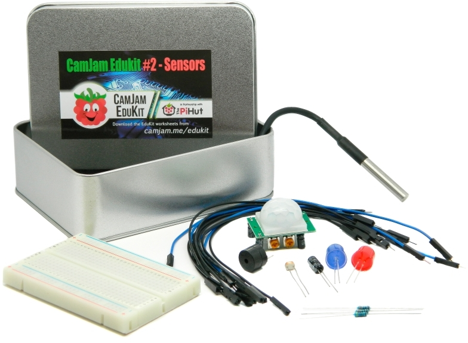

# CamJam Edukit 2

The code contained within this repository is for use with the CamJam Edukit 2 - Sensors, created by the organisers of The Cambridge Raspberry Jam (http://camjam.me), an event for fans of the Raspberry Pi.

The kit costs only £8 including UK VAT, and is available from [The Pi Hut](http://thepihut.com/collections/camjam-edukit)
